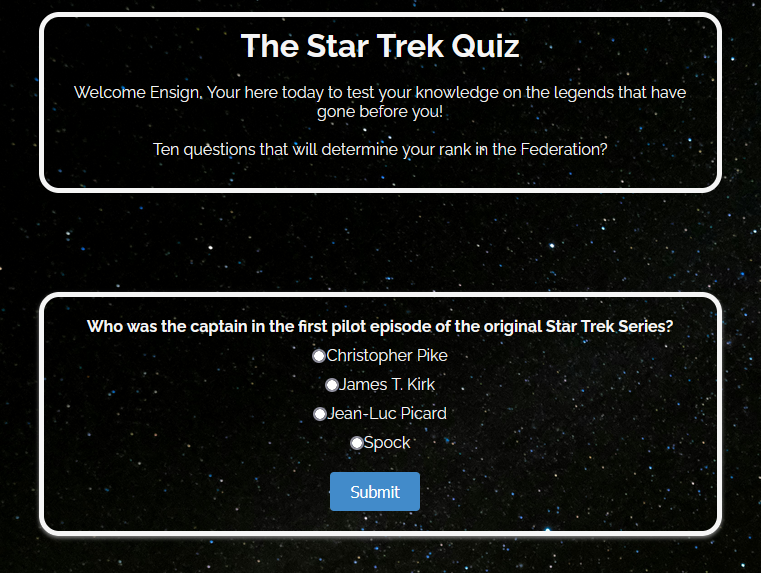
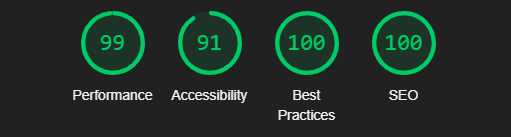
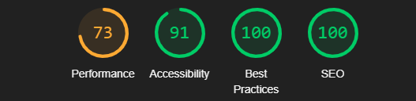

### Star Trek Quiz

The Star Trek Quiz is an interactive quiz consisting of 10 questions from the Star Trek Universe.
[Live Site](https://d-claffey-code-institute.github.io/Star-Trek-Quiz/)

## CONTENT LINKS

### [User Experience(UX/UI)](#user-experience)

- [User stories](#user-stories)
- [Color Scheme](#color-scheme)
- [Typography](#typography)
- [Wireframes](#wire-frames)

### [Features](#features)

- [Overview](#overview)

### [Technologies Used](#technologies-used-1)

- [Languages Used](#languages)
- [Frameworks, Libraries and Programs](#frameworks-libraries-and-programs)

### [Testing](#testing-1)

- [Code validation](#code-validation)
- [Accessability](#accessability)

## User Experience

The quiz is of a simple design consisting of 10 questions. At the end of the quiz the user will get a rank depending on their score. They can then retry the quiz if they like. 

### User Stories
As a user:
* I want the site to be simple and easy to navigate
* I want to be able to test my knowledge of the Star Trek universe.
* I want to be able to easily find the site in search engines.

### As a Developer:
As a developer:
* I want the user to easily navigate the site.
* I want the user to be challenged.
* I want the user to try again to achieve a higher rank.

### Color Scheme
The site consists of a background showing a picture of space. So I used text and bordering with the colour "Whitesmoke"

### Typography
The font used is easy to read and clear against the dark background
For the font I used the Google font, Raleway
Here is the link https://fonts.google.com/specimen/Raleway

### Wire frames

Wire Frames are made using Balsamiq and shown here.
[Wireframe](assets/readme/wireframe.png)

## Features

### Overview

The website is fully responsonsive on all screen sizes

### Future Features
In the future i would like to add differnet quizes for the differeseries of Star Trek.

## Technologies used

### Languages

<li>HTML</li>
<li>CSS</li>
<li>Javascript</li>

### Frameworks, Libraries and Programs

#### Google Fonts
I imported Google fonts and placed it in the style tag in the HTML file.
#### Favicon
For my Favicon, I used a Star Trek favicon from https://freefavicon.com/freefavicons/objects/iconinfo/star-trek-badge-152-203991.html

#### Github
I used Github to store my project and to deploy it.
#### Am I Responsive
I used the Am I responsive website to give a screenshot of how my site looks on various screen sizes. 
#### Balsamiq
I used Balsamiq to create the wireframe for my project.

## Testing

### Code Validation

I used W3C Jigsaw to validate the CSS, which came back with no errors

I used W3C Markup to validate the HTML file, which returned no errors.
Document checking completed. No errors or warnings to show.

I used JSHint to validate the javascript code, which resulted in no errors

### Accessibility

To check the sites accessibility, I used Lighthouse in Dev Tools

Desktop:

Mobile:

#### Unsolved Bugs:
Site shows a white border on the bottom of the screen on Am I Responsive, this doesnt show in Dev Tools on Chrome.

## Deployment
I used Gitpod to develop the code and then pushed to Github.

Here are the following steps I used to deploy the website from Github repository to Github Pages.

1. Log in to Github and find the repository you wish to deploy.
2. At the top of the page, click on "Settings".
3. On the left hand side of the settings page, under Code and automation, click on "Pages".
4. From the source section drop-down menu, select the Main Branch.
5. Click Save.

## Credits
### Content
The wireframe was created using [Balsamiq](https://balsamiq.com/)

The Questions for the game were taken from https://www.chipublib.org/blogs/post/quiz-how-well-do-you-know-star-trek/

Quiz tutorial code from https://www.codewithfaraz.com/content/161/build-a-quiz-application-with-html-css-and-javascript-step-by-step-guide

Font from [Google Fonts](https://fonts.google.com/)

Favicon from [Free Favicon](https://freefavicon.com/freefavicons/objects/iconinfo/star-trek-badge-152-203991.html)

